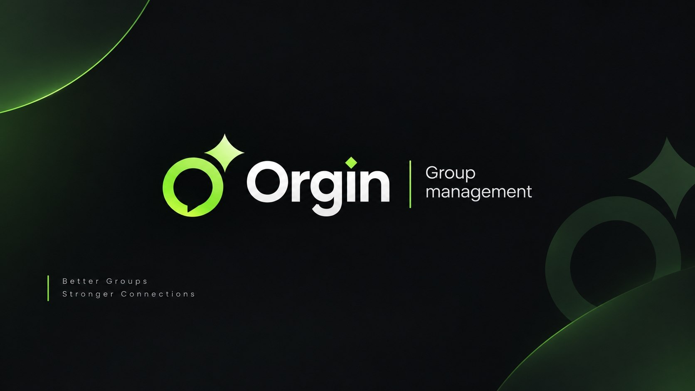

<div align="center">



# 🟢 Orgin Bot — مستندات جامع

### سامانه پیشرفته و نسل‌جدید مدیریت، امنیت و هوش مصنوعی گروه‌های تلگرام

[](https://t.me/orginsupport)
[](#)
[](#)
[](#)
[](#-فهرست-مستندات)

**زبان مستندات:** فارسی 🇮🇷 · **پشتیبانی ربات:** فارسی / انگلیسی

[💬 پشتیبانی](https://t.me/orginsupport) ·
[👨‍💻 سازنده](https://t.me/NewMovieSupportHQ) ·
[🎮 ربات بازی همکار](https://t.me/Orgingamerobot) ·
[🚀 شروع نصب](./docs/00-getting-started.md)

</div>

---

> ⚠️ **توجه مهم:** این Repository صرفاً یک **مرجع مستندسازی (Documentation Repository)** برای ربات تلگرامی **Orgin Bot** است.
> سورس‌کد ربات در این مخزن قرار **ندارد** و قرار نیست اضافه شود؛ هدف این پروژه، ارائهٔ یک راهنمای کامل، دقیق و منظم از تمام قابلیت‌ها، دستورات و پنل‌های ربات — دقیقاً بر پایهٔ اسناد رسمی — است.

---

## 📖 دربارهٔ Orgin Bot

**Orgin Bot** یک ربات مدیریت گروه تلگرامی نسل‌جدید (Enterprise Production Edition) است که مدیریت، امنیت، نظم‌دهی و سرگرمی گروه‌های سوپرگروه تلگرام را با بهره‌گیری از **هوش مصنوعی Gemini Pro** یکپارچه می‌کند. این ربات دارای پنل شیشه‌ای کامل، ده‌ها قفل و محدودیت قابل تنظیم، سیستم مدیریت نقش‌ها، ابزارهای پاکسازی، دستیار هوشمند فارسی‌زبان (Orgin AI) و امکانات پریمیوم اختصاصی است.

| ویژگی کلیدی | توضیح کوتاه |
|---|---|
| 🔒 بیش از ۳۰ نوع قفل | کنترل کامل محتوای متنی، رسانه‌ای، امنیتی و زبانی گروه |
| ⚙️ پنل تنظیمات پیشرفته | ۱۷ بخش تخصصی قابل مدیریت با دکمه‌های شیشه‌ای |
| 🤖 دستیار هوش مصنوعی Orgin AI | فرمان‌های عامیانه، جستجوی زندهٔ وب، ویس‌به‌ویس |
| 🛡️ امنیت درجه‌یک | ضد تبچی، ضد اسپم، ضد فلود، ضد خیانت ادمین‌ها |
| 👑 سلسله‌مراتب نقش‌ها | مالک، جانشین، مدیر، ناظر، ویژه (VIP)، لیست سفید |
| 🎮 سرگرمی و بازی | چالش جرأت/حقیقت، فال حافظ، دانستنی، جوک، تاس، سکه |
| 💎 اشتراک پریمیوم | امکانات نامحدود، درگاه استارز تلگرام و کریپتو TON |

---

## 📑 فهرست مستندات

جهت سهولت دسترسی، مستندات به‌صورت موضوعی در پوشهٔ [`docs/`](./docs) دسته‌بندی شده‌اند:

| # | فصل | محتوا |
|:---:|---|---|
| ۰۰ | [🚀 شروع سریع و نصب](./docs/00-getting-started.md) | افزودن ربات، ارتقا به ادمین، نصب اولیه، همگام‌سازی مدیران |
| ۰۱ | [🗺️ نقشهٔ راهنما و ساختار درختی](./docs/01-navigation-sitemap.md) | نقشهٔ پی‌وی، پنل شیشه‌ای گروه، منوی راهنما |
| ۰۲ | [🔒 قفل‌ها و محدودیت‌ها](./docs/02-locks.md) | قفل‌های متنی، رسانه‌ای، امنیتی و زبانی |
| ۰۳ | [🆕 قابلیت‌های جدید (آخرین آپدیت)](./docs/03-new-features.md) | تأیید عضویت، واکنش هوشمند، رسانهٔ موقت، ضد خیانت، ریست کارخانه |
| ۰۴ | [⚠️ مدیریت اعضا، اخطار، سکوت و بن](./docs/04-moderation.md) | اخطار، میوت، بن، سنجاق پیام |
| ۰۵ | [🧹 ابزار پاکسازی گروه](./docs/05-clean-tools.md) | حذف پیام، پاکسازی ربات‌ها، اکانت‌های حذف‌شده |
| ۰۶ | [⛔ فیلتر کلمات و پاسخ‌های خودکار](./docs/06-filter-autoreply.md) | لیست سیاه کلمات و Auto-Reply |
| ۰۷ | [👑 نقش‌ها، مدیران و لیست سفید](./docs/07-roles-permissions.md) | سلسله‌مراتب دسترسی و دستورات ارتقا/عزل |
| ۰۸ | [🔮 اد اجباری، عضویت اجباری و کاپچا](./docs/08-force-add-fsub-captcha.md) | Force Add، F-Sub، Join Captcha |
| ۰۹ | [💬 خوش‌آمد، خروج و قوانین](./docs/09-welcome-goodbye-rules.md) | ویرایشگر پیام‌ها و متغیرهای داینامیک |
| ۱۰ | [🤖 دستیار هوش مصنوعی Orgin AI](./docs/10-orgin-ai.md) | فرمان عامیانه، جستجوی وب، ویس، مود شخصیتی |
| ۱۱ | [🎮 سرگرمی، بازی و آمار فعالیت](./docs/11-fun-games-stats.md) | چالش، فال، جوک، XP، تاپ چت |
| ۱۲ | [🛡️ امنیت گروه (ضد تبچی / اسپم / فلود)](./docs/13-anti-spam-security.md) | ماژول‌های امنیتی تکمیلی |
| ۱۳ | [💎 اشتراک پریمیوم و پشتیبانی](./docs/12-premium.md) | امکانات VIP، درگاه‌های پرداخت |
| ۱۴ | [📚 فهرست کامل دستورات](./docs/14-commands-reference.md) | مرجع سریع همهٔ دستورات ربات در یک جدول |
| — | [❓ سوالات متداول (FAQ)](./FAQ.md) | رفع اشکال و پاسخ به پرسش‌های پرتکرار |
| — | [🗒️ تاریخچهٔ تغییرات (Changelog)](./CHANGELOG.md) | آخرین قابلیت‌های اضافه‌شده به ربات |
| — | [🤝 راهنمای مشارکت](./CONTRIBUTING.md) | نحوهٔ پیشنهاد اصلاح مستندات |

---

## ⚡ شروع سریع

```text
۱) ربات را با دکمهٔ «➕ افزودن به گروه» یا لینک t.me/YourBot?startgroup=true وارد گروه کنید
۲) دسترسی‌های Delete Messages ،Ban Users ،Pin Messages و Invite Users را به ربات بدهید
۳) در گروه دستور  نصب  (یا /start) را ارسال کنید
۴) با ارسال دستور  پنل  یا /panel به کنترل‌پنل گرافیکی دسترسی پیدا کنید
```

📄 راهنمای کامل گام‌به‌گام: [**۰۰ - شروع سریع و نصب**](./docs/00-getting-started.md)

---

## 🗂️ ساختار پروژه

```text
orgin-bot-/
├── README.md                      ← همین فایل (نمای کلی پروژه)
├── FAQ.md                         ← سوالات متداول و عیب‌یابی
├── CHANGELOG.md                   ← تاریخچهٔ به‌روزرسانی‌ها
├── CONTRIBUTING.md                ← راهنمای مشارکت در مستندات
├── LICENSE                        ← مجوز استفاده از مستندات
├── docs/                          ← مستندات موضوعی و تفصیلی
│   ├── 00-getting-started.md
│   ├── 01-navigation-sitemap.md
│   ├── 02-locks.md
│   ├── 03-new-features.md
│   ├── 04-moderation.md
│   ├── 05-clean-tools.md
│   ├── 06-filter-autoreply.md
│   ├── 07-roles-permissions.md
│   ├── 08-force-add-fsub-captcha.md
│   ├── 09-welcome-goodbye-rules.md
│   ├── 10-orgin-ai.md
│   ├── 11-fun-games-stats.md
│   ├── 12-premium.md
│   ├── 13-anti-spam-security.md
│   └── 14-commands-reference.md
└── assets/
    ├── images/                    ← لوگو، بنر و آیکون‌های رسمی
    │   └── README.md
    └── screenshots/                ← اسکرین‌شات‌های پنل‌ها و منوها (بعداً تکمیل می‌شود)
        └── README.md
```

---

## 👑 سلسله‌مراتب دسترسی (خلاصه)

| ردیف | نقش | سطح دسترسی |
|:---:|---|---|
| ۱ | 👑 مالک گروه (Creator) | دسترسی کامل به تمام بخش‌ها و قفل‌ها |
| ۲ | 🤝 جانشین مالک (Co-Owner) | تمام اختیارات به‌جز عزل مالک |
| ۳ | 🛠️ مدیر ارشد (Admin) | اعمال قفل‌ها، پاکسازی، سکوت و بن |
| ۴ | 👁️ ناظر (Moderator) | تذکر، اخطار و پاکسازی پیام‌های متخلف |
| ۵ | 🌟 عضو ویژه (VIP) | معافیت از برخی قفل‌ها و سقف کاراکتر |
| ۶ | ⚪ لیست سفید (Whitelist) | مصونیت مطلق از تمام قفل‌ها و فیلترها |

جزئیات کامل → [۰۷ - نقش‌ها، مدیران و لیست سفید](./docs/07-roles-permissions.md)

---

## 💎 پریمیوم Orgin Bot

<table>
<tr><td>

✅ ناظر هوشمند ضد کلاهبرداری با هوش مصنوعی
✅ پاسخ‌گوی هوشمند سوالات تخصصی گروه (AI FAQ)
✅ سیستم تیکتینگ داخلی گروه

</td><td>

✅ سرورهای اولویت‌دار VIP (پاسخ زیر ۵۰ms)
✅ ضد تبچی و ضد رید سطح Enterprise
✅ پشتیبان‌گیری ابری روزانه خودکار
✅ مکالمهٔ صوتی ویس‌به‌ویس نامحدود

</td></tr>
</table>

جزئیات و روش‌های خرید → [۱۲ - اشتراک پریمیوم و پشتیبانی](./docs/12-premium.md)

---

## 📞 ارتباط با ما

| کانال ارتباطی | لینک |
|---|---|
| 🎧 پشتیبانی مستقیم و سازندهٔ ربات | [@NewMovieSupportHQ](https://t.me/NewMovieSupportHQ) |
| 📢 گروه رسمی پشتیبانی کاربران | [@orginsupport](https://t.me/orginsupport) |
| 🎮 ربات رسمی بازی‌های تلگرام (همکار) | [@orgingamerobot](https://t.me/Orgingamerobot) |

---

<div align="center">

**تهیه و تنظیم:** تیم فنی، طراحی و توسعهٔ پلتفرم هوشمند Orgin Bot

<sub>این Repository صرفاً برای مستندسازی ساخته شده و شامل سورس‌کد ربات نیست.</sub>

</div>
